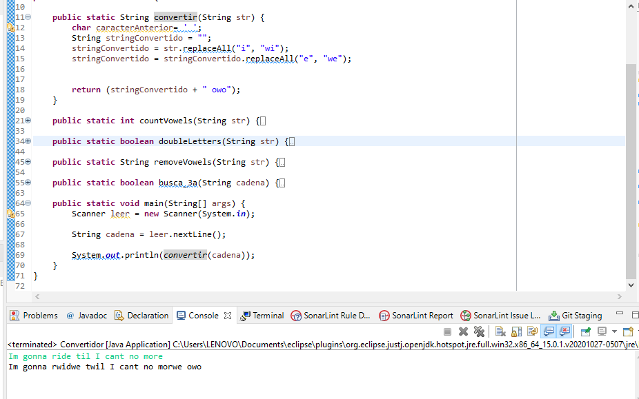
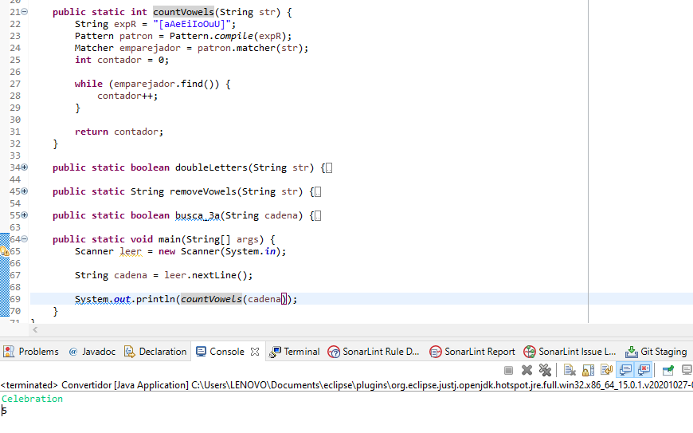
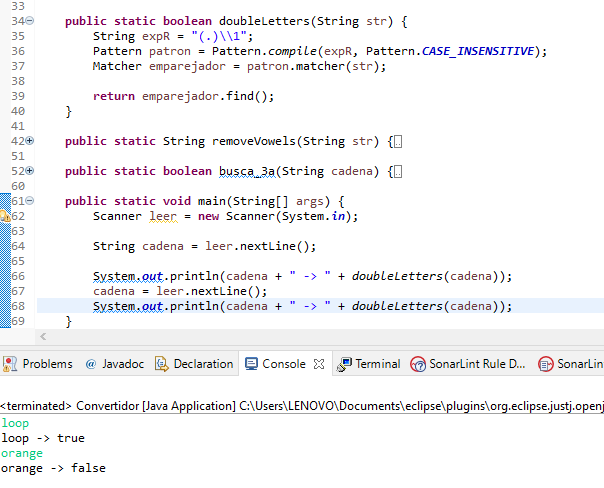
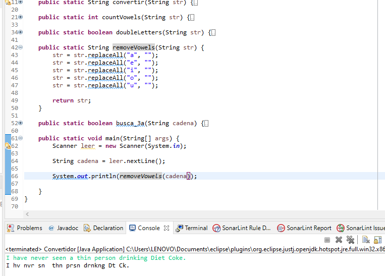

 # Universidad Autonoma de Campeche :school:

:mortar_board: Carlos A. Capriel Gabriel 

:computer: Ingenieria en sistemas computacionales 

:orange_book: Compiladores 

### Indice :bookmark_tabs:
1. [Manejo de expresiones regulares](#tarea1)
    1. [Resultado remplazo de letras](#remplazoL)
    2. [Resultado contador vocales](#contadorV)
    3. [Resultado letras identicas consecutivas](#letrasC)
    4. [Resultado de remover vocales](#removeV)

## Manejo de expresiones regulares :pencil2:
Codigo fuente: [Convertidor.java](Convertidor.java)

### Resultado remplazo de letras

### Resultado contador de vocales

### Resultado de letras identicas consecutivas

### Resultado de remover vocales

